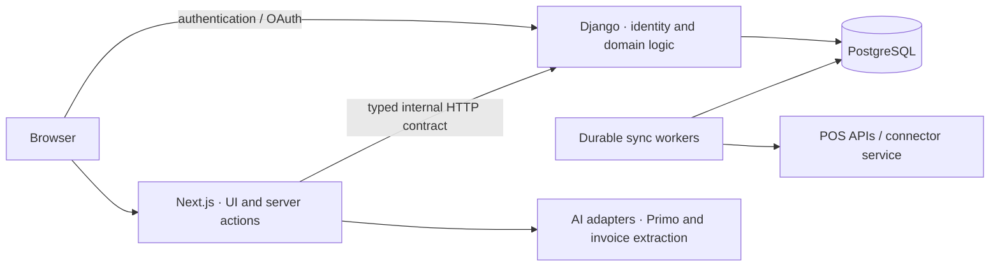

# Forkluck

**Cost a recipe the way you actually write one.** Paste the lines, get the price, the water, the labor, the prime cost.

Forkluck is an open-source recipe formulation, costing, labor, and sales workbench for working kitchens. Use the hosted app, or run the whole thing yourself.

Live at **[forkluck.com](https://forkluck.com)**. It's early — `0.0.x`, moving fast, and the schema still changes.

*Synthetic example: calculated costs and missing prices stay visible.*

## Getting started

Hosted is the quickest way in: sign up at [app.forkluck.com](https://app.forkluck.com) and paste a recipe. Your data stays private to your account.

Want to run it yourself? Local setup is in [Contributing](.github/CONTRIBUTING.md), how the pieces fit together is in [ARCHITECTURE.md](ARCHITECTURE.md), and your own server is in [docs/DEPLOYMENT.md](docs/DEPLOYMENT.md).

## What it does

- Paste a recipe the way you'd write it — `620 g Flour`, `8 ea Eggs` — and it parses.
- Live water, dry matter, baker's percentages, and ingredient coverage.
- Yield, portions, ingredient cost, kitchen timings, median labor, prime cost.
- Pantry prices, aliases, spreadsheet import, and sales pulled from Square and Shopify.
- Recipes are never published, indexed, or pooled into a shared corpus.

It's a kitchen planning tool, not a medical nutrition calculator. The formulation engine keeps a small visible seed table and lets pantry ingredients map to USDA FoodData Central — the model is written out in [ARCHITECTURE.md](ARCHITECTURE.md#the-analysis-model).

## Architecture at a glance

Django authorizes every data operation. AI proposes structured output; domain
code validates it, and users confirm writes. Long supplier and POS syncs run
through persisted jobs. See [ARCHITECTURE.md](ARCHITECTURE.md) for the source
map and [docs/CONTRACT.md](docs/CONTRACT.md) for the HTTP contract.

## Where to contribute

| Work | Start here |
| --- | --- |
| Recipe costing and measurements | [Measurement rules](docs/INGREDIENT_MEASURES.md), `apps/web/lib/benchcost/`, `apps/api/forkluck/domains/recipes/` |
| UI and interactions | `apps/web/app/`, `apps/web/components/`, [save system](docs/SAVE_SYSTEM.md) |
| Primo and invoice AI | [AI boundaries](ARCHITECTURE.md#ai-boundaries), [evaluations](docs/EVALUATIONS.md) |
| Supplier connectors | [`services/connectors/`](services/connectors/), [connector protocol](docs/CONNECTOR_PROTOCOL.md) |
| Ingredient measurements and aliases | [`data/catalog/`](data/catalog/), an open CC0 dataset |
| Guidance for coding agents | [`skills/`](skills/) |
| Ghost newsletter delivery | [Azure mail provider](https://github.com/forkluck/forkluck-azure-provider) |

The application (`apps/web`), its API (`apps/api`), the AI code inside them,
the supplier connector service (`services/connectors`), the ingredient catalog
(`data/catalog`), and the agent skills (`skills`) share this monorepo. The
mail provider is a separate repository with its own runtime. Marketing working
files, credentials, and customer data are kept outside the public source.

## Built with

Next.js 16 and React 19 on the front, Django 5.2 and PostgreSQL behind it, Tailwind 4 and shadcn/ui in between. Vitest, Playwright, and Django's test runner keep it honest.

## Contributing

Bug reports, feature proposals, product feedback, and technical analysis are welcome from everyone. Start in [Contributing](.github/CONTRIBUTING.md), follow the [Code of Conduct](CODE_OF_CONDUCT.md), and report vulnerabilities privately through [SECURITY.md](SECURITY.md).

## License

Copyright © 2026 Forkluck.

Free software under the [GNU AGPL, version 3 or later](LICENSE). Run a modified version as a network service and you owe its users the source.

The ingredient catalog under `data/catalog/` is [CC0](data/catalog/LICENSE);
bundled Inter fonts retain their [SIL Open Font License](apps/web/app/fonts/OFL.txt).
Everything else in this repository, including the connector service and the
agent skills, is under the AGPL.
