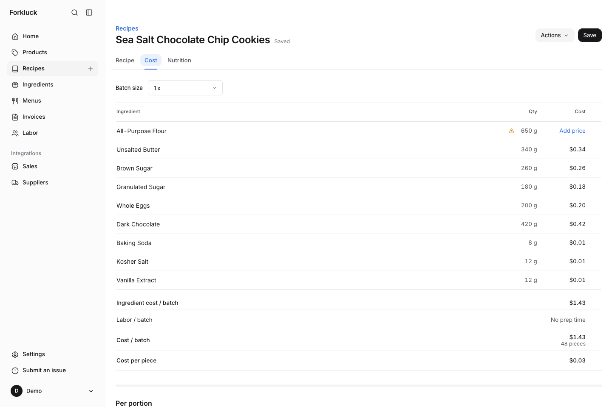

# Forkluck

Recipe costing, formulation, labor and sales for working kitchens.

[forkluck.com](https://forkluck.com) · [App](https://app.forkluck.com) · [Feedback](https://feedback.forkluck.com) · [Contributing](.github/CONTRIBUTING.md) · [Architecture](ARCHITECTURE.md)

Forkluck reads a recipe the way a cook writes it, one ingredient per line, and gives back the numbers: ingredient cost, yield and portions, water and dry matter, baker's percentages, kitchen timings, labor, and prime cost against sales from Square and Shopify. Prices live in a pantry, so a change there updates every recipe that uses it. Recipes are private to the account and never pooled or indexed.

## Hosted

The quickest way in is [app.forkluck.com](https://app.forkluck.com). Sign up and paste a recipe.

## Self-hosting

Forkluck is a Next.js app in front of a Django API, with a worker for POS syncs and an optional supplier connector service. [docs/DEPLOYMENT.md](docs/DEPLOYMENT.md) covers putting it on a server of your own.

## Contributing

Development setup, the ingredient catalog, and how changes get reviewed are in [CONTRIBUTING.md](.github/CONTRIBUTING.md). How the pieces fit together is in [ARCHITECTURE.md](ARCHITECTURE.md). The ingredient catalog under [`data/catalog/`](data/catalog/) is an open CC0 dataset and takes pull requests on its own.

## Getting help

Product ideas and feedback go on [feedback.forkluck.com](https://feedback.forkluck.com). Bugs go in [GitHub issues](https://github.com/forkluck/forkluck/issues). Security issues go privately, as described in [SECURITY.md](SECURITY.md).

## Copyright and license

Copyright © 2026 Forkluck. Released under the [GNU AGPL, version 3 or later](LICENSE). The ingredient catalog is [CC0](data/catalog/LICENSE) and the bundled Inter fonts keep their [SIL Open Font License](apps/web/app/fonts/OFL.txt).
