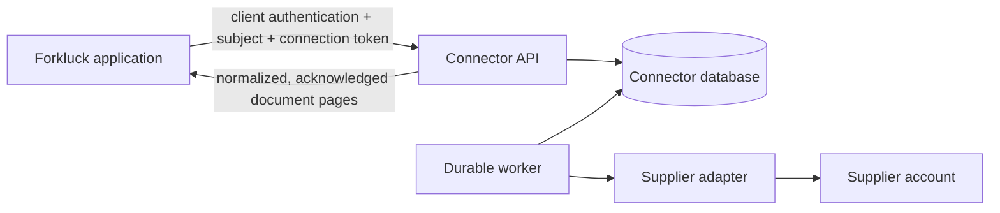

# Forkluck Connectors

Supplier invoice and credit acquisition for [Forkluck](../../README.md). It
lives in the Forkluck monorepo under `services/connectors/` and shares the
repository's [AGPL-3.0-or-later](../../LICENSE) license. Supplier credentials,
sessions, documents, and deployment secrets are private runtime data.

The service has its own HTTP process, durable worker, database, and encryption
key. Forkluck receives normalized documents and stores an opaque connection
token; supplier passwords never enter the application or its AI prompts.



Baldor is the first adapter. See [Adding a provider](docs/ADDING_A_PROVIDER.md)
for the extension contract and synthetic test examples.

## Local development

Python 3.13 is used in CI. From the repository root:

```sh
cd services/connectors
python3.13 -m venv .venv
.venv/bin/pip install -r requirements-dev.txt
cd ../..
pnpm connectors:setup
pnpm connectors:dev
```

`pnpm connectors:setup` runs `manage.py bootstrap_local`: it creates `.env`
from `.env.example`, writes a generated `CONNECTORS_ENCRYPTION_KEY` into it
once (keep it: credentials stored locally are unreadable without it), runs
the migrations, and registers the local Forkluck app as a service client. It
then writes the three `FORKLUCK_CONNECTOR_*` settings into `apps/api/.env`.
`config/settings.py` reads `.env` itself in development, so nothing needs to
be sourced or exported. Start the worker in another terminal:

```sh
pnpm connectors:worker
```

To register any other application, use
`manage.py provision_service_client <id> <callback-url>` with the callback
`<app origin>/api/integrations/connectors/callback`, and configure the printed
client id and one-time secret in that application's environment. Development
opens Baldor to every subject through `CONNECTORS_PROVIDER_ALLOWLIST` in
`.env.example`; production requires explicit subject ids. The test suite uses
synthetic providers and makes no live supplier calls.

## Verification

From the repository root, `pnpm verify:connectors` runs the same five checks:

```sh
.venv/bin/ruff format --check config connectors manage.py
.venv/bin/ruff check config connectors manage.py
.venv/bin/python manage.py test
.venv/bin/python manage.py makemigrations --check --dry-run
.venv/bin/python manage.py check
```

CI runs these checks with PostgreSQL so concurrency and locking tests also run.
The service ships through `.github/workflows/deploy-connectors.yml` on pushes
to `main` that touch this directory. See the shared
[protocol](../../docs/CONNECTOR_PROTOCOL.md) and [operations](docs/OPERATIONS.md).

## Contributing

No supplier account is needed to run the tests. For a new supplier, follow
[Adding a provider](docs/ADDING_A_PROVIDER.md) and include synthetic examples
of its document formats and failures.

Keep changes scoped to one behavior. Preserve client, subject, provider,
connection, and run identity throughout authorization and delivery. A protocol
change updates [`docs/CONNECTOR_PROTOCOL.md`](../../docs/CONNECTOR_PROTOCOL.md),
the schema under `docs/schemas/`, and the consumer and its tests in `apps/api`
in the same pull request.

Use fabricated accounts, invoice numbers, products, and amounts. Never submit
captured account pages, cookies, passwords, customer documents, or production
configuration. Errors and logs must not expose raw provider responses.

Report security issues through the repository's
[private reporting process](../../SECURITY.md). Copyright © 2026 Forkluck.
